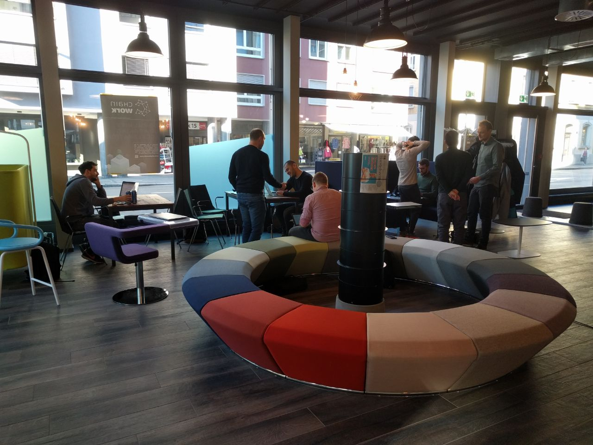
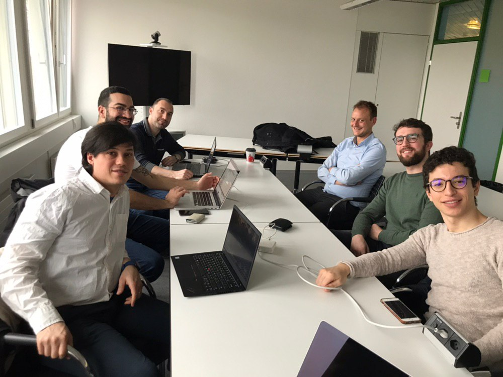
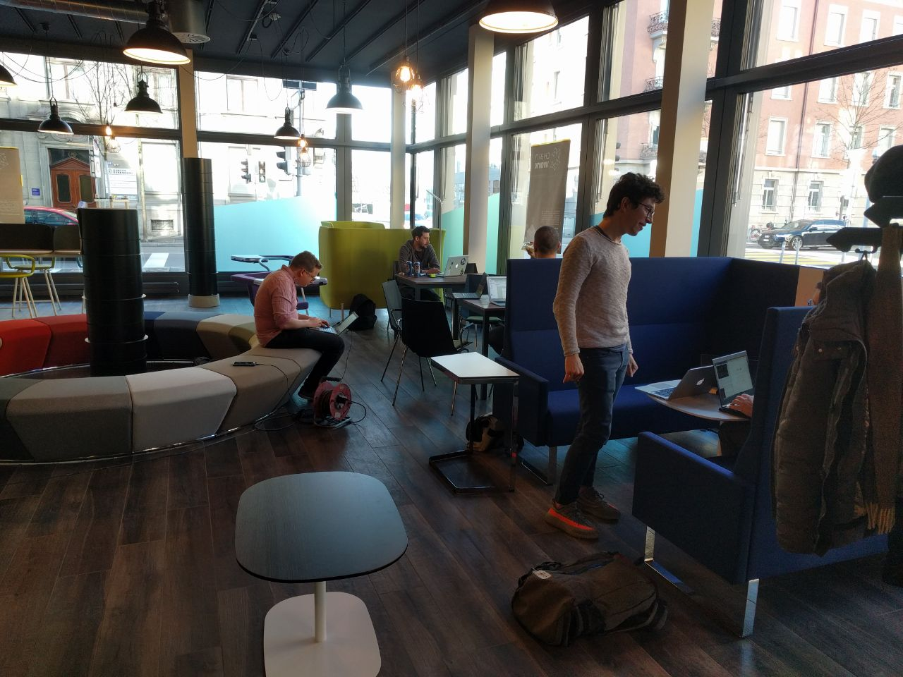
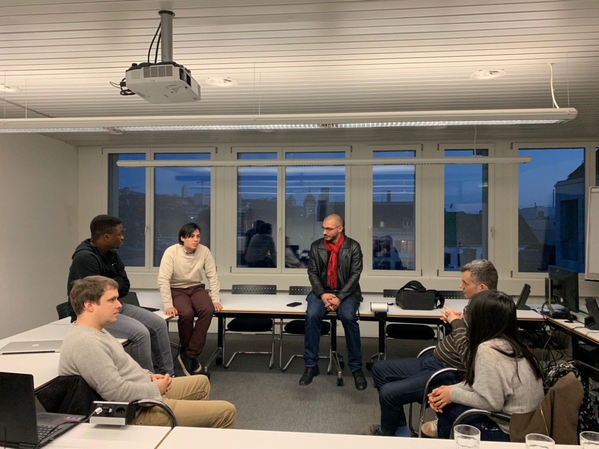

<!-- start what we offer section -->
<section>
    

        

            <h3>About Us</h3>
            
Our group is a platform to socialize, network, learn, build and research and more. We organize into two main categories, research and development. In both categories anyone can form or join a team to develop and learn something they are passionate about.
              Every team creates and controls a public GitHub repository in our organization and can use it to collaborate, share, and advance their topics of choice. We have software development groups for full stack smart contract development or even protocol level development, we have groups for researching blockchain technologies as well as for researching legal, regulatory, environmental, etc, topics in relation to blockchain technologies. It's completely up to you what you want to do and we will do our best to support your R or D (or both). Our members can also run workshops and other activities for select teams or for our whole group from time to time.

        

        

            

                

            

            

                

            

            

                

            

            

                

            

            

                

            

        

    

</section>
<!-- end service section -->
